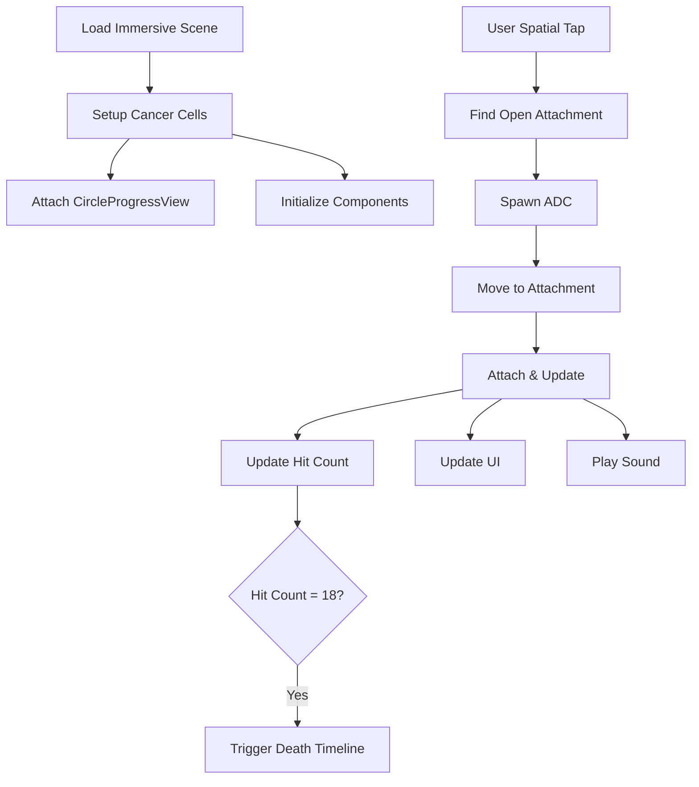

# Cancer Cell Targeting Game - RealityKit ECS Implementation Plan

## Asset Structure

### Cancer Cell Model
Base cancer cell model with components:
- CancerCellComponent (hitCount)
- Input/Collision components
- Animation library (death animation)
- Audio library (death sound)
- Spatial audio component
- Behavior component ("cancerCellDeath" timeline)
- 18 transforms with AttachmentPoint components

### Immersive.usda
- Contains two prototype cancer cells (left/right)
- Each cell is an instance of the base cancer cell model
- Will be replaced with procedural spawning in future

### ADC-spawn.usda
Template for spawned ADCs with:
- Audio Library (Drones_01.wav, Sonic_Pulse_Hit_01.wav)
- Spatial audio component
- ADCComponent (state tracking)

## Game Flow

1. Scene Loading
   - Load Immersive.usda containing cancer cells
   - Each cancer cell has 18 attachment points
   - Each cancer cell gets a CircleProgressView attachment
   - Initialize components and verify loading

2. Gameplay Loop
   - User performs spatial tap on cancer cell
   - System finds open attachment point
   - ADC spawns in random position in front of user
   - ADC moves to attachment point
   - On attachment:
     * ADC parents to attachment point
     * Updates cancer cell hit count
     * Updates CircleProgressView
     * Plays attach sound
   - At 18 hits:
     * Triggers cancer cell death timeline
     * Removes cell and attached ADCs

## Reference Project Analysis

### HappyBeam
Relevant for:
- UI updates from ECS state changes
- Cloud state visualization
- Event system for beam interactions

### SwiftSplash
Relevant for:
- Complex entity movement and attachment
- Track piece connection system
- Component update patterns

### BOTAnist
Relevant for:
- Timeline/animation triggering
- Plant growth system
- Component registration

### Spaceship
Relevant for:
- Entity spawning and movement
- Path generation
- Audio handling

## Current Issues

1. Asset Loading
   - CancerCellComponent serialization failing in RCP
   - Need to verify all components are present
   - Component registration order verification needed

2. Component Management
   - Proper ECS pattern for hit count updates
   - Attachment point availability tracking
   - Event system structure

3. UI Updates
   - CircleProgressView update mechanism
   - SwiftUI/RealityKit state synchronization

## Next Steps

1. Asset Loading (Priority)
   - Fix CancerCellComponent serialization
   - Verify component loading
   - Add debug logging for loaded components
   - Test scene loading

2. Component System
   - Review and update AttachmentSystem
   - Implement proper event system
   - Set up component queries

3. UI Integration
   - Implement proper CircleProgressView updates
   - Add state synchronization
   - Test UI responsiveness

## Questions to Resolve

1. Best practice for CircleProgressView updates from ECS
2. Proper implementation of attachment point management
3. Event system structure for state updates

## Reference Implementation Notes

[To be filled in as we analyze each reference project's relevant systems]
