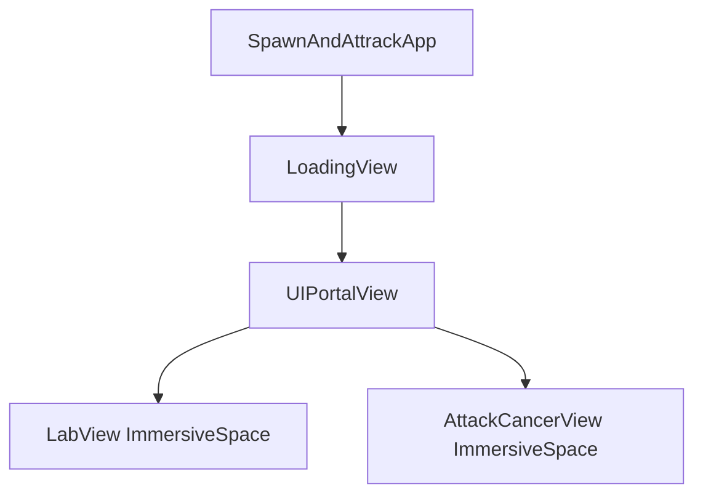
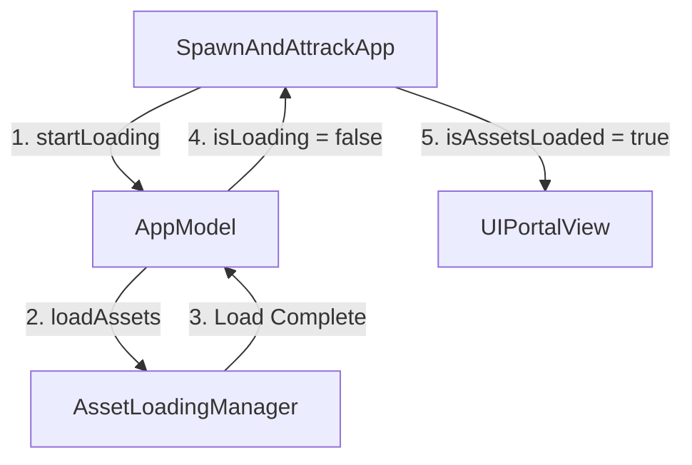

```mermaid
graph TD
    A[SpawnAndAttrackApp] --> B[LoadingView]
    B --> C[UIPortalView]
    C --> D1[LabView ImmersiveSpace]
    C --> D2[AttackCancerView ImmersiveSpace]
```

```mermaid
graph TD
    A[SpawnAndAttrackApp] --> |1. startLoading| B[AppModel]
    B --> |2. loadAssets| C[AssetLoadingManager]
    C --> |3. Load Complete| B
    B --> |4. isLoading = false| A
    A --> |5. isAssetsLoaded = true| E[UIPortalView]
```